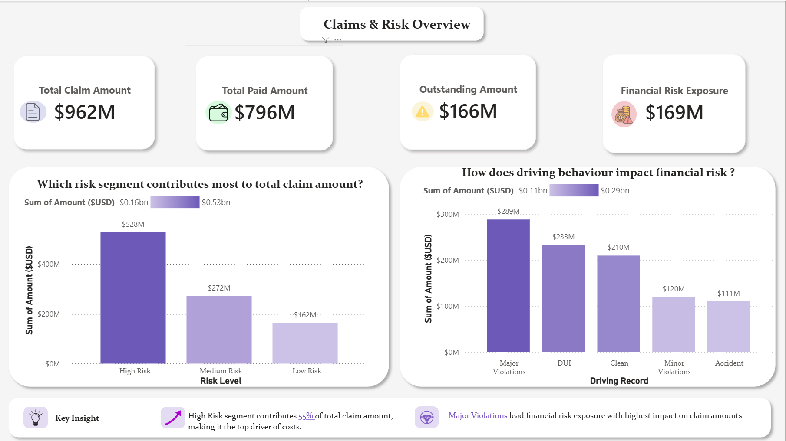
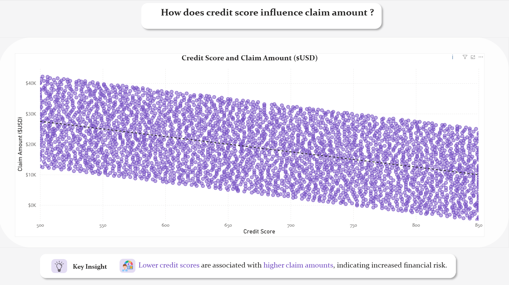
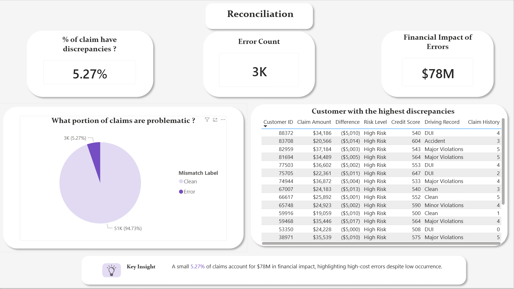
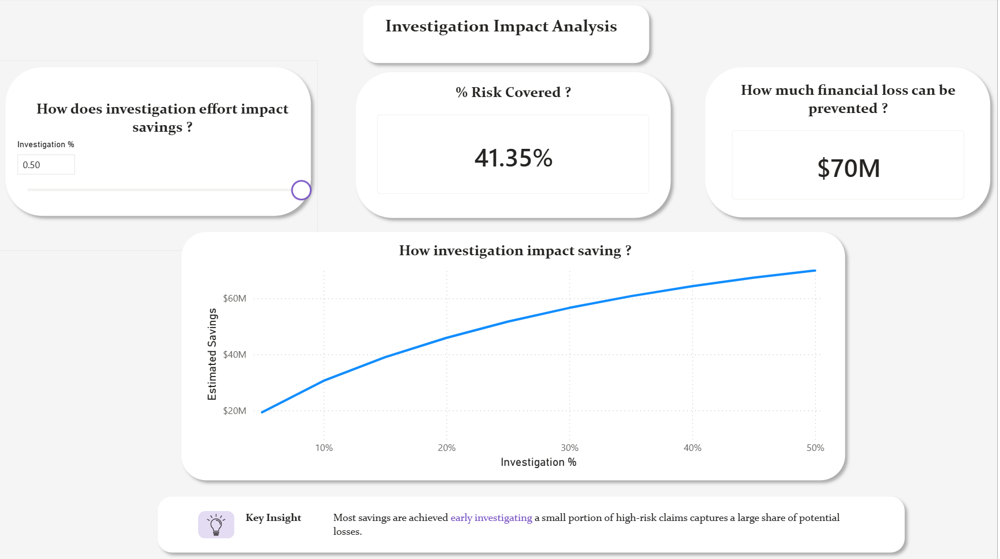

#  Risk-Based Claims Investigation Analysis

##  Overview

This project analyzes insurance claim data to identify high-risk cases and estimate potential financial savings through targeted investigation.

It demonstrates how a data-driven approach can optimize investigation efforts instead of reviewing all claims, improving efficiency and reducing losses.

---

##  Objectives

* Identify high-risk claims contributing most to financial exposure
* Analyze relationships between risk factors and claim amounts
* Detect discrepancies in claims data
* Simulate investigation strategies to estimate potential savings

---

##  Project Workflow

### 1️ Data Analysis (Jupyter Notebook)

* Loaded and explored dataset using Pandas
* Performed basic data cleaning and structure validation
* Conducted Exploratory Data Analysis (EDA)
* Analyzed:

  * Risk level distribution
  * Claim amount by risk segment
  * Relationship between credit score and claim amount
* Generated initial insights used for dashboard design

📓 Notebook: `notebooks/Finance_project.ipynb`

---

### 2️ Dashboard Development (Power BI)

Built an interactive dashboard to translate analysis into actionable insights:

####  Claims & Risk Overview

* Total claim amount, paid amount, outstanding amount
* Risk segmentation
* Impact of driving behavior on claims

####  Risk & Claim Analysis

* Credit score vs claim amount relationship
* Identification of high-risk patterns

####  Claims Reconciliation & Error Analysis

* Detection of mismatches and discrepancies
* Financial impact of errors
* Identification of high-risk problematic cases

####  Investigation Strategy & Impact

* Interactive simulation of investigation effort
* Savings curve showing diminishing returns
* Helps determine optimal investigation level

---

##  Key Insights

* High-risk claims contribute disproportionately to total claim value
* Lower credit scores are associated with higher claim amounts
* Financial discrepancies are concentrated in high-risk segments
* Investigating a subset of high-risk claims captures significant savings
* Additional investigation shows diminishing returns beyond a threshold

---

##  Methodology

* Claims ranked based on risk indicators (risk level, discrepancies, behavioral factors)
* Top N% claims selected dynamically using parameter-driven filtering
* Estimated savings calculated using discrepancy (difference) values
* Scenario analysis performed using Power BI What-If parameter

---

##  Tools & Technologies

* **Python** (Pandas, Matplotlib, Seaborn)
* **Power BI**
* **DAX (Data Analysis Expressions)**

---

##  Dashboard Preview

### 🔹 Overview

### 🔹 Investigation

### 🔹 Reconciliation

### 🔹 Credit Analysis

---

##  Conclusion

This project highlights how targeted investigation of high-risk claims is more efficient than reviewing all claims.

A data-driven prioritization strategy enables organizations to reduce financial losses while optimizing operational effort.

---

##  Key Learning

* Importance of combining EDA with dashboard storytelling
* Translating raw data insights into business decisions
* Using simulation techniques to support strategic planning
